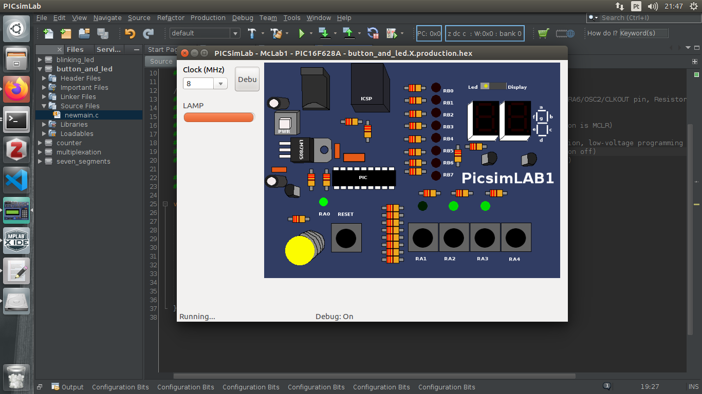

#### Button and LED

#### Professor: Raphaell Maciel de Sousa

1. Write a program to turn on a LED after push a button. The LED should turn off if you aren't pushing the button.

<p align="center">
    
</p>

```sh
/*
 * File:   newmain.c
 * Author: raphaell
 *
 * Created on 1 de Março de 2020, 21:33
 */

#include <xc.h>

#define _XTAL_FREQ 8000000

// CONFIG
#pragma config FOSC = EXTRCCLK  // Oscillator Selection bits (RC oscillator: CLKOUT function on RA6/OSC2/CLKOUT pin, Resistor and Capacitor on RA7/OSC1/CLKIN)
#pragma config WDTE = OFF       // Watchdog Timer Enable bit (WDT disabled)
#pragma config PWRTE = OFF      // Power-up Timer Enable bit (PWRT disabled)
#pragma config MCLRE = ON       // RA5/MCLR/VPP Pin Function Select bit (RA5/MCLR/VPP pin function is MCLR)
#pragma config BOREN = ON       // Brown-out Detect Enable bit (BOD enabled)
#pragma config LVP = ON         // Low-Voltage Programming Enable bit (RB4/PGM pin has PGM function, low-voltage programming enabled)
#pragma config CPD = OFF        // Data EE Memory Code Protection bit (Data memory code protection off)
#pragma config CP = OFF         // Flash Program Memory Code Protection bit (Code protection off)

#define button RA1 
#define LED RA0 

void main(void) {
    
    TRISA0 = 0; //Output
    TRISA1 = 1; //Input
    
    if(button == 1){
        LED = 0;
    }
    else{
        LED = 1;
    }    
    return;
}
``` 


