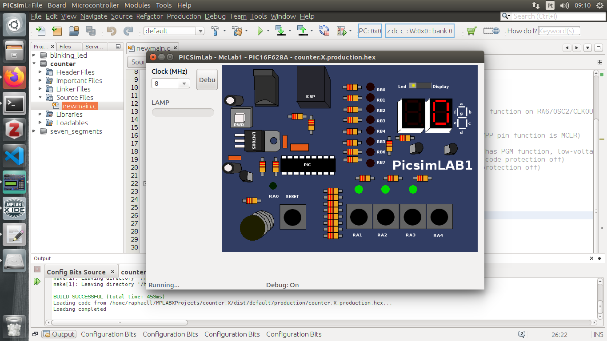

#### Counter with seven-segments displays

#### Professor: Raphaell Maciel de Sousa

**[*Back to home page*](https://github.com/raphaellmsousa/microcontrollers)**  

1. Create the project seven_segments (use our first class and follow the steps to create the project).

2. Write a program to show the number "0" on the secound display.

```sh
/*
 * File:   newmain.c
 * Author: raphaell
 *
 * Created on 29 de Fevereiro de 2020, 09:05
 */


#include <xc.h>

#define _XTAL_FREQ 8000000

#pragma config FOSC = EXTRCCLK  // Oscillator Selection bits (RC oscillator: CLKOUT function on RA6/OSC2/CLKOUT pin, Resistor and Capacitor on RA7/OSC1/CLKIN)
#pragma config WDTE = OFF       // Watchdog Timer Enable bit (WDT disabled)
#pragma config PWRTE = OFF      // Power-up Timer Enable bit (PWRT disabled)
#pragma config MCLRE = ON       // RA5/MCLR/VPP Pin Function Select bit (RA5/MCLR/VPP pin function is MCLR)
#pragma config BOREN = ON       // Brown-out Detect Enable bit (BOD enabled)
#pragma config LVP = ON         // Low-Voltage Programming Enable bit (RB4/PGM pin has PGM function, low-voltage programming enabled)
#pragma config CPD = OFF        // Data EE Memory Code Protection bit (Data memory code protection off)
#pragma config CP = OFF         // Flash Program Memory Code Protection bit (Code protection off)

void main(void) {
    
    TRISB = 0;
    
    PORTB = 0b11111110;
    
    return;
}
```

<p align="center">
    
</p> 

3. Now, create a counter from 0 to 3.

```sh
/*
 * File:   newmain.c
 * Author: raphaell
 *
 * Created on 29 de Fevereiro de 2020, 09:05
 */


#include <xc.h>

#define _XTAL_FREQ 8000000

#pragma config FOSC = EXTRCCLK  // Oscillator Selection bits (RC oscillator: CLKOUT function on RA6/OSC2/CLKOUT pin, Resistor and Capacitor on RA7/OSC1/CLKIN)
#pragma config WDTE = OFF       // Watchdog Timer Enable bit (WDT disabled)
#pragma config PWRTE = OFF      // Power-up Timer Enable bit (PWRT disabled)
#pragma config MCLRE = ON       // RA5/MCLR/VPP Pin Function Select bit (RA5/MCLR/VPP pin function is MCLR)
#pragma config BOREN = ON       // Brown-out Detect Enable bit (BOD enabled)
#pragma config LVP = ON         // Low-Voltage Programming Enable bit (RB4/PGM pin has PGM function, low-voltage programming enabled)
#pragma config CPD = OFF        // Data EE Memory Code Protection bit (Data memory code protection off)
#pragma config CP = OFF         // Flash Program Memory Code Protection bit (Code protection off)

void main(void) {
    
    TRISB = 0;
    
    PORTB = 0b11111110;
    __delay_ms(1000);
    PORTB = 0b00111000;
    __delay_ms(1000);
    PORTB = 0b11011101;
    __delay_ms(1000);
    PORTB = 0b01111101;
    __delay_ms(1000);
    
    return;
}
```
4. It is possible to use the decimal representation as follow:

```sh
/*
 * File:   newmain.c
 * Author: raphaell
 *
 * Created on 29 de Fevereiro de 2020, 09:05
 */


#include <xc.h>

#define _XTAL_FREQ 8000000

#pragma config FOSC = EXTRCCLK  // Oscillator Selection bits (RC oscillator: CLKOUT function on RA6/OSC2/CLKOUT pin, Resistor and Capacitor on RA7/OSC1/CLKIN)
#pragma config WDTE = OFF       // Watchdog Timer Enable bit (WDT disabled)
#pragma config PWRTE = OFF      // Power-up Timer Enable bit (PWRT disabled)
#pragma config MCLRE = ON       // RA5/MCLR/VPP Pin Function Select bit (RA5/MCLR/VPP pin function is MCLR)
#pragma config BOREN = ON       // Brown-out Detect Enable bit (BOD enabled)
#pragma config LVP = ON         // Low-Voltage Programming Enable bit (RB4/PGM pin has PGM function, low-voltage programming enabled)
#pragma config CPD = OFF        // Data EE Memory Code Protection bit (Data memory code protection off)
#pragma config CP = OFF         // Flash Program Memory Code Protection bit (Code protection off)

void main(void) {
    
    TRISB = 0;
    
    PORTB = 254;
    __delay_ms(1000);
    PORTB = 56;
    __delay_ms(1000);
    PORTB = 221;
    __delay_ms(1000);
    PORTB = 125;
    __delay_ms(1000);
    
    return;
}
```

**Challenge**: use a vector with the numbers from 0 to 9 and implement the seven segments display counter scanning this vector.

```sh

/*
 * File:   newmain.c
 * Author: raphaell
 *
 * Created on 27 de Março de 2020, 08:19
 */


#include <xc.h>

#define _XTAL_FREQ 8000000

#pragma config FOSC = EXTRCCLK  // Oscillator Selection bits (RC oscillator: CLKOUT function on RA6/OSC2/CLKOUT pin, Resistor and Capacitor on RA7/OSC1/CLKIN)
#pragma config WDTE = OFF       // Watchdog Timer Enable bit (WDT disabled)
#pragma config PWRTE = OFF      // Power-up Timer Enable bit (PWRT disabled)
#pragma config MCLRE = ON       // RA5/MCLR/VPP Pin Function Select bit (RA5/MCLR/VPP pin function is MCLR)
#pragma config BOREN = ON       // Brown-out Detect Enable bit (BOD enabled)
#pragma config LVP = ON         // Low-Voltage Programming Enable bit (RB4/PGM pin has PGM function, low-voltage programming enabled)
#pragma config CPD = OFF        // Data EE Memory Code Protection bit (Data memory code protection off)
#pragma config CP = OFF         // Flash Program Memory Code Protection bit (Code protection off)

int segments[] = {
    /*To do
     Complete the vector with the correspondent binary numbers
     to write, in the seven-segments display, numbers
     from 0 to 9*/
};

void main(void) {
    
    TRISB = 0;
       
    while (1) { 
   	/*To do
	write your code here!*/

    }
    
    return;
}

```

**[*Back to home page*](https://github.com/raphaellmsousa/microcontrollers)**  
