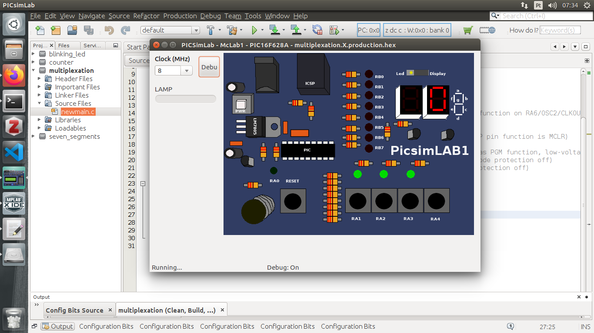
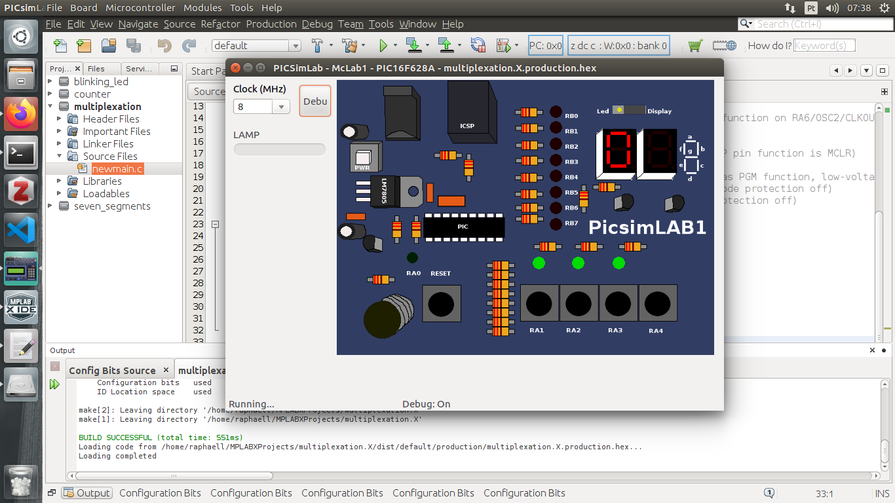
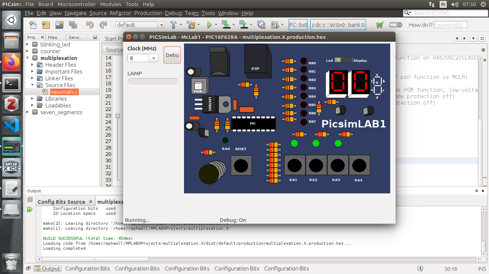
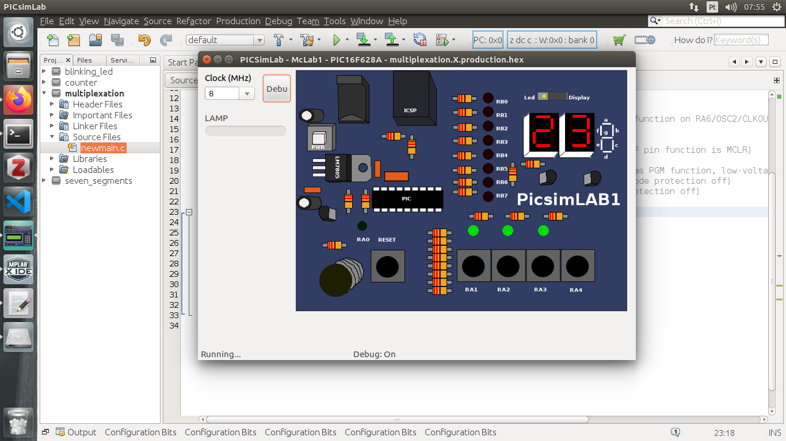

#### Multiplexing seven-segments displays

#### Professor: Raphaell Maciel de Sousa

* **[*Back to home page*](https://github.com/raphaellmsousa/microcontrollers)**  

1. Create the project seven_segments (use our first class and follow the steps to create the project).

2. Write the number zero in the right display, as follow:

<p align="center">
    
</p> 

```sh
/*
 * File:   newmain.c
 * Author: raphaell
 *
 * Created on 1 de Março de 2020, 07:30
 */


#include <xc.h>

#define _XTAL_FREQ 8000000

// CONFIG
#pragma config FOSC = EXTRCCLK  // Oscillator Selection bits (RC oscillator: CLKOUT function on RA6/OSC2/CLKOUT pin, Resistor and Capacitor on RA7/OSC1/CLKIN)
#pragma config WDTE = OFF       // Watchdog Timer Enable bit (WDT disabled)
#pragma config PWRTE = OFF      // Power-up Timer Enable bit (PWRT disabled)
#pragma config MCLRE = ON       // RA5/MCLR/VPP Pin Function Select bit (RA5/MCLR/VPP pin function is MCLR)
#pragma config BOREN = ON       // Brown-out Detect Enable bit (BOD enabled)
#pragma config LVP = ON         // Low-Voltage Programming Enable bit (RB4/PGM pin has PGM function, low-voltage programming enabled)
#pragma config CPD = OFF        // Data EE Memory Code Protection bit (Data memory code protection off)
#pragma config CP = OFF         // Flash Program Memory Code Protection bit (Code protection off)

void main(void) {
    
    TRISB = 0;
    
    PORTB = 0b111111110;
    
    return;
}
```

3. Now, write zero in the left display.

<p align="center">
    
</p> 

```sh
/*
 * File:   newmain.c
 * Author: raphaell
 *
 * Created on 1 de Março de 2020, 07:30
 */


#include <xc.h>

#define _XTAL_FREQ 8000000

// CONFIG
#pragma config FOSC = EXTRCCLK  // Oscillator Selection bits (RC oscillator: CLKOUT function on RA6/OSC2/CLKOUT pin, Resistor and Capacitor on RA7/OSC1/CLKIN)
#pragma config WDTE = OFF       // Watchdog Timer Enable bit (WDT disabled)
#pragma config PWRTE = OFF      // Power-up Timer Enable bit (PWRT disabled)
#pragma config MCLRE = ON       // RA5/MCLR/VPP Pin Function Select bit (RA5/MCLR/VPP pin function is MCLR)
#pragma config BOREN = ON       // Brown-out Detect Enable bit (BOD enabled)
#pragma config LVP = ON         // Low-Voltage Programming Enable bit (RB4/PGM pin has PGM function, low-voltage programming enabled)
#pragma config CPD = OFF        // Data EE Memory Code Protection bit (Data memory code protection off)
#pragma config CP = OFF         // Flash Program Memory Code Protection bit (Code protection off)

void main(void) {
    
    TRISB = 0;
    
    //PORTB = 0b111111110; //right display
    
    PORTB = 0b111101110; //left display
    
    return;
}
```

4. Write the number zero in the left and right display in the same program, but use a delay of 1s between them.

```sh
/*
 * File:   newmain.c
 * Author: raphaell
 *
 * Created on 1 de Março de 2020, 07:30
 */


#include <xc.h>

#define _XTAL_FREQ 8000000

// CONFIG
#pragma config FOSC = EXTRCCLK  // Oscillator Selection bits (RC oscillator: CLKOUT function on RA6/OSC2/CLKOUT pin, Resistor and Capacitor on RA7/OSC1/CLKIN)
#pragma config WDTE = OFF       // Watchdog Timer Enable bit (WDT disabled)
#pragma config PWRTE = OFF      // Power-up Timer Enable bit (PWRT disabled)
#pragma config MCLRE = ON       // RA5/MCLR/VPP Pin Function Select bit (RA5/MCLR/VPP pin function is MCLR)
#pragma config BOREN = ON       // Brown-out Detect Enable bit (BOD enabled)
#pragma config LVP = ON         // Low-Voltage Programming Enable bit (RB4/PGM pin has PGM function, low-voltage programming enabled)
#pragma config CPD = OFF        // Data EE Memory Code Protection bit (Data memory code protection off)
#pragma config CP = OFF         // Flash Program Memory Code Protection bit (Code protection off)

void main(void) {
    
    TRISB = 0;
    
    PORTB = 0b111111110; //right display
    __delay_ms(1000);
    PORTB = 0b111101110; //left display
    __delay_ms(1000);
    
    return;
}
```

5. Change the delay for 100 ms. What is the result we should expect?

6. Decrease even more the delay. You should see both left and right displays presenting the number zero.

<p align="center">
    
</p> 

Solution:

```sh
void main(void) {
    
    TRISB = 0;
    
    PORTB = 0b111111110; //right display
    __delay_ms(40);
    PORTB = 0b111101110; //left display
    __delay_ms(40);
    
    return;
}
```

7. Write the number 23 by using multiplexation.

<p align="center">
    
</p> 

Solution:

```sh
void main(void) {
    
    TRISB = 0;
    
    PORTB = 0b01111101; //right display
    __delay_ms(40);
    PORTB = 0b11001101; //left display
    __delay_ms(40);
    
    return;
}
```

* **[*Back to home page*](https://github.com/raphaellmsousa/microcontrollers)**  
