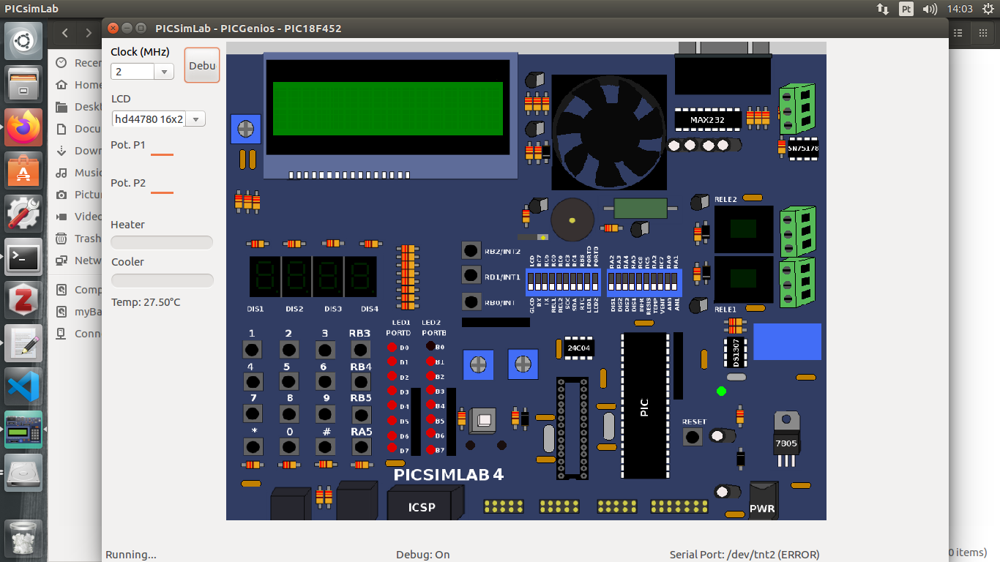
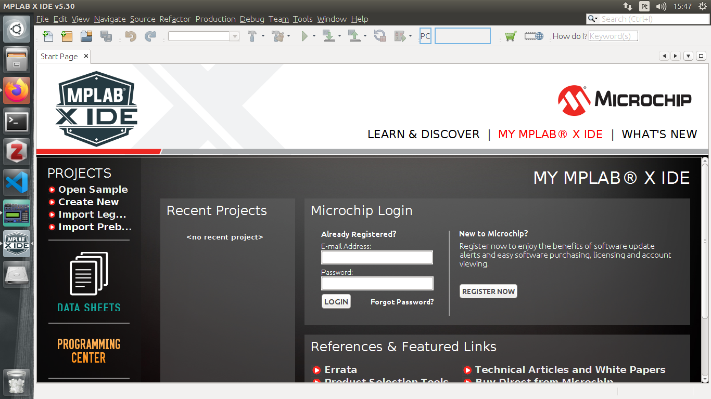

# Course of Microcontrollers
* **Professor**: Raphaell Maciel de Sousa
* **Institution**: IFPB Cajazeiras
* **Course**: Industrial Automation
* **Year**: 2020

**[*Back to home page*](https://github.com/raphaellmsousa/microcontrollers)**  

1. **Install the Pickitlab from**:

* **[*Pickitlab*](https://github.com/lcgamboa/picsimlab/releases)** 

Obs.: choose the version 0.7 for ubuntu

<p align="center">
    
</p> 

2. **Install the compiler**

Here, we are going to use the MPLAB XC8 Compiler. Follow the instructions to download:

* **[*Compiler download*](https://microchipdeveloper.com/xc8:installation)** 

3. **Install the IDE**

Now it is time to install the MPLAB X IDE. Go to download section and choose the version for your OS. You can find the MPLAB X **[*Here*](https://www.microchip.com/mplab/mplab-x-ide)** 

<p align="center">
    
</p> 

Follow the instructions to install the IDE:

* **[*Install IDE*](https://microchipdeveloper.com/mplabx:installation)** 

```bash
$ tar -xvf MPLABX-vX.XX-linux-installer.tar
$ chmod u+x MPLABX-vX.XX-linux-installer.sh
$ sudo ./MPLABX-vX.XX-linux-installer.sh
```

Obs.: for installation dependencies on 64-bit Linux, follow this tutorial: 

* **[*Dependences*](https://microchipdeveloper.com/install:mplabx-lin64)** 

Use the bash to install the dependencies as follow:

```bash
$ sudo apt-get install libc6:i386 libx11-6:i386 libxext6:i386 libstdc++6:i386 libexpat1:i386
```

<p align="center">
    
</p> 

You can find more details about this setup **[*Here*](https://www.youtube.com/watch?v=aUlM6eUv7tA)**.

**[*Back to home page*](https://github.com/raphaellmsousa/microcontrollers)**  
