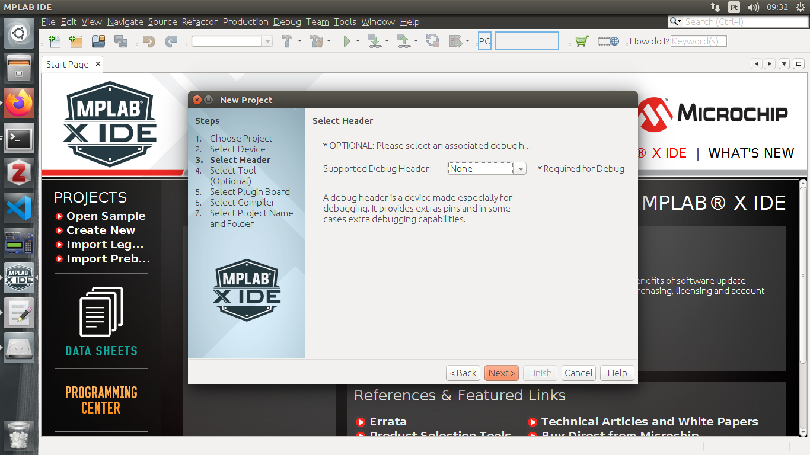
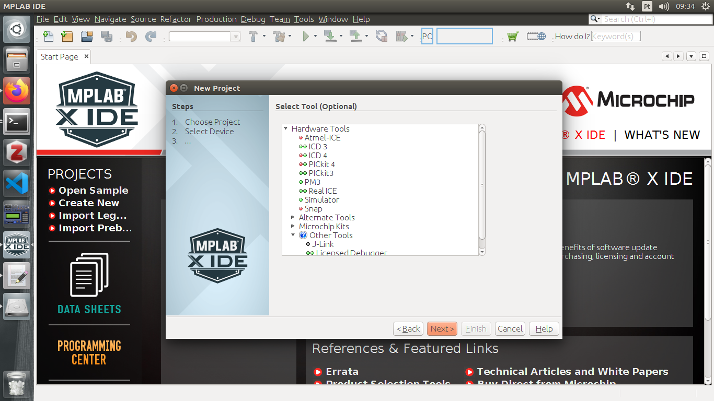
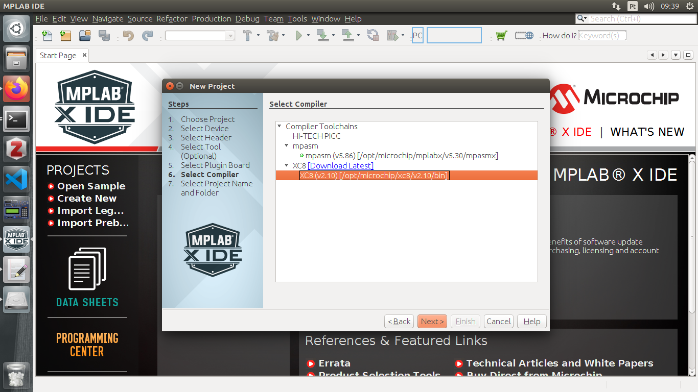
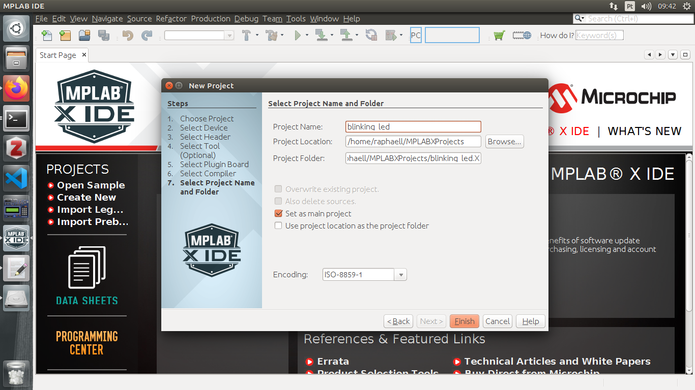
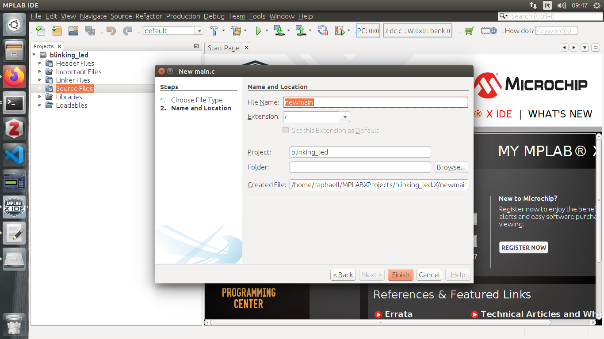
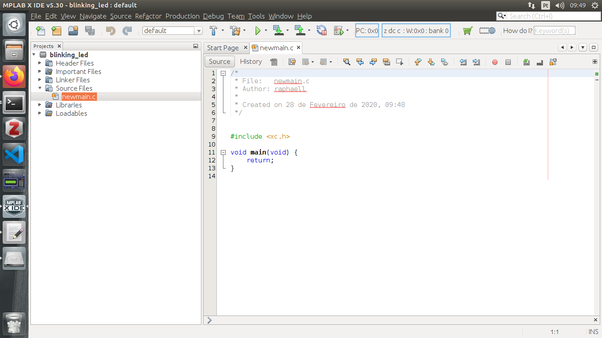
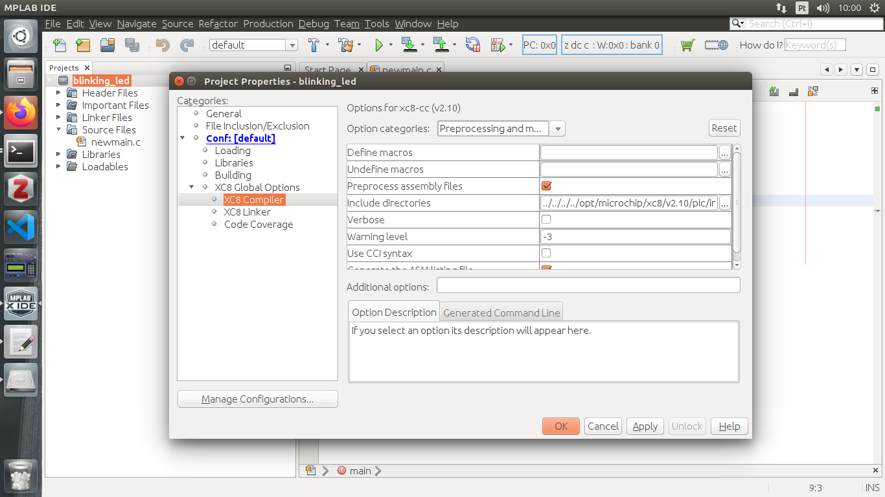

### First project

#### Blink LED

#### Professor: Raphaell Maciel de Sousa


1. Open the MPLAB IDE:

<p align="center">
    
</p> 

2. File -> new project -> Standalone Project -> Next:

<p align="center">
    
</p> 

3. Choose the Family Mid-Range 8-bit MCUs (PIC10/12/16/MCP) and Device: PIC16F628A. Press Next.

<p align="center">
    
</p>

4. Press Next:

<p align="center">
    
</p>

5. Press Next:

<p align="center">
    
</p>

6. Choose XC8 compiler and write down the path and press Next:

<p align="center">
    
</p>

7. Type the project's name and press Finish:

<p align="center">
    
</p>

8. Click with right button on Source Files and choose New -> main.c and press Finish:

<p align="center">
    
</p>

9. After step 8, you must see this screen:

<p align="center">
    
</p>

This is the generated code from MPLAB X:

```bash
/*
 * File:   newmain.c
 * Author: raphaell
 *
 * Created on 28 de Fevereiro de 2020, 09:48
 */


#include <xc.h>

void main(void) {
    return;
}

```

10. Go to project name (linking_led) press it with the right button and go to properties. Click on XC8 Compiler and enter with the path writed in the step 6.

<p align="center">
    
</p>

