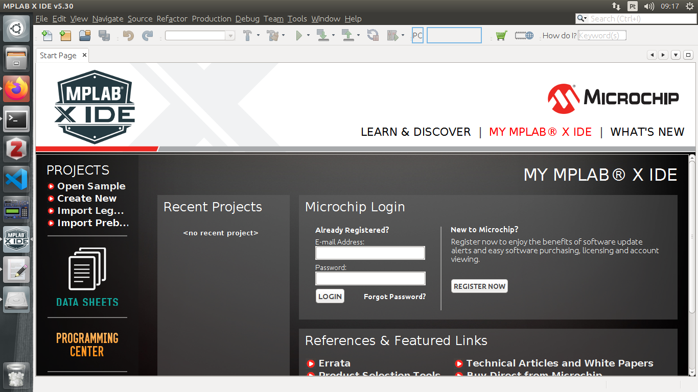
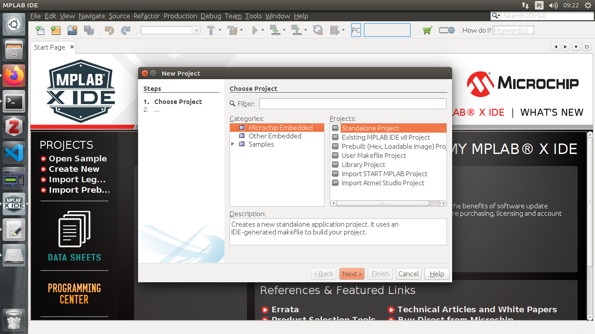
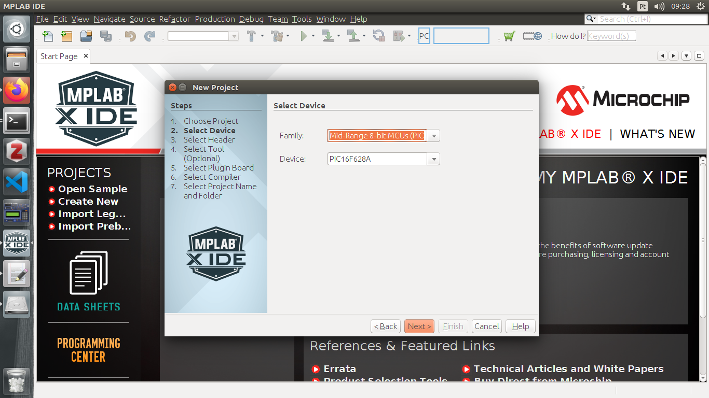

### First project

#### Blink LED

#### Professor: Raphaell Maciel de Sousa

1. Open the MPLAB IDE:

    

 

2. File -> new project -> Standalone Project -> Next:

    

 

3. Choose the Family Mid-Range 8-bit MCUs (PIC10/12/16/MCP) and Device: PIC16F628A

    

