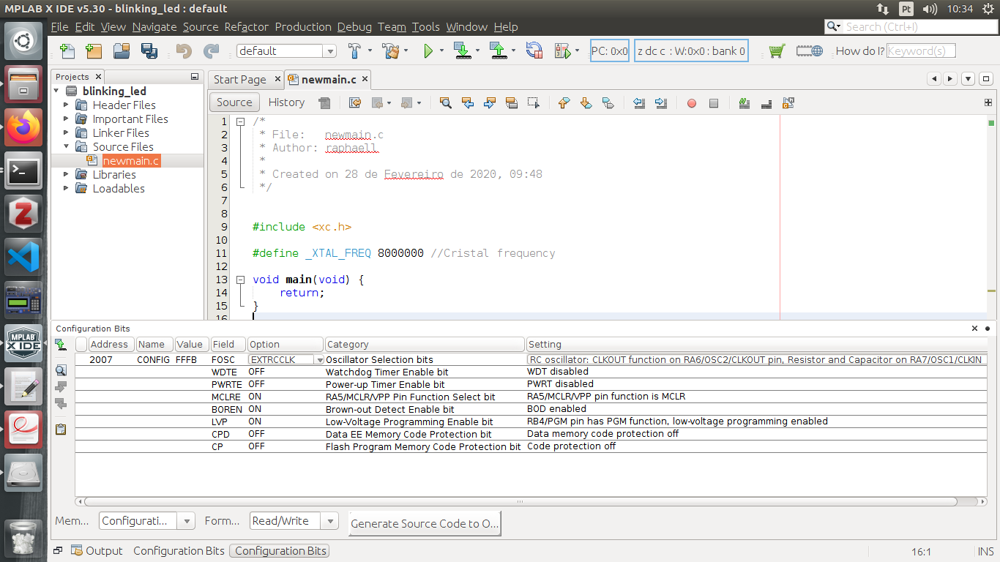

### First project

#### Blink LED

#### Professor: Raphaell Maciel de Sousa


1. Open the MPLAB IDE:

<p align="center">
    
</p> 

2. File -> new project -> Standalone Project -> Next:

<p align="center">
    
</p> 

3. Choose the Family Mid-Range 8-bit MCUs (PIC10/12/16/MCP) and Device: PIC16F628A. Press Next.

<p align="center">
    
</p>

4. Press Next:

<p align="center">
    
</p>

5. Press Next:

<p align="center">
    
</p>

6. Choose XC8 compiler and write down the path and press Next:

<p align="center">
    
</p>

7. Type the project's name and press Finish:

<p align="center">
    
</p>

8. Click with right button on Source Files and choose New -> main.c and press Finish:

<p align="center">
    
</p>

9. After step 8, you must see this screen:

<p align="center">
    
</p>

This is the generated code from MPLAB X:

```bash
/*
 * File:   newmain.c
 * Author: raphaell
 *
 * Created on 28 de Fevereiro de 2020, 09:48
 */


#include <xc.h>

void main(void) {
    return;
}

```

10. Go to project name (linking_led) press it with the right button and go to properties. Click on XC8 Compiler and in the option include directories, enter with the path writed in the step 6. Press OK.

<p align="center">
    
</p>

11. Go to menu Production -> Set Configuration Bits. Now, set the bits as follow:

<p align="center">
    
</p>

```bash
/*
 * File:   newmain.c
 * Author: raphaell
 *
 * Created on 28 de Fevereiro de 2020, 09:48
 */


#include <xc.h>

#pragma config FOSC = EXTRCCLK  // Oscillator Selection bits (RC oscillator: CLKOUT function on RA6/OSC2/CLKOUT pin, Resistor and Capacitor on RA7/OSC1/CLKIN)
#pragma config WDTE = OFF       // Watchdog Timer Enable bit (WDT disabled)
#pragma config PWRTE = OFF      // Power-up Timer Enable bit (PWRT disabled)
#pragma config MCLRE = ON       // RA5/MCLR/VPP Pin Function Select bit (RA5/MCLR/VPP pin function is MCLR)
#pragma config BOREN = ON       // Brown-out Detect Enable bit (BOD enabled)
#pragma config LVP = ON         // Low-Voltage Programming Enable bit (RB4/PGM pin has PGM function, low-voltage programming enabled)
#pragma config CPD = OFF        // Data EE Memory Code Protection bit (Data memory code protection off)
#pragma config CP = OFF         // Flash Program Memory Code Protection bit (Code protection off)

#define _XTAL_FREQ 8000000 //Cristal frequency

void main(void) {
    
    TRISB0 = 0;
    
    RB0 = 1;
    __delay_ms(1000);
    
    RB0 = 0;
    __delay_ms(1000);
    
    return;
}

```
