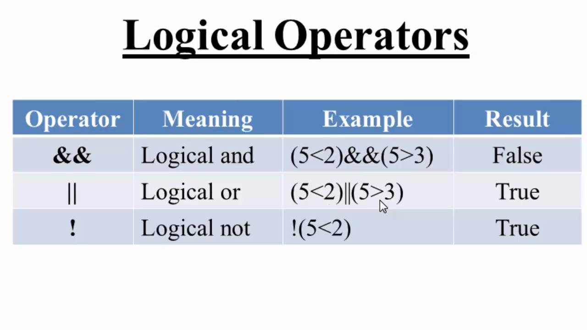

<p align="center">
    
</p> 

Figure from: https://www.edx.org/learn/computer-programming

# Introduction To C Coding

**[*Back to home page*](https://github.com/raphaellmsousa/microcontrollers)**  

Table of Contents 

 1. [Coding in C](#coding)
 2. [C vs Assembly](#assembly)
 3. [Structure of a C Program](#structure)
 4. [Numeric Bases](#bases)
 5. [Variables](#variables)
 6. [Data Types](#data)
 7. [Math Operators](#math)
 8. [Relational Operators, Logic and Bitwise](#relation)
 9. [Flow Control](#flow)
 10.[Functions](#func)

Obs.: this content is based on this course **[*here!*](https://www.udemy.com/course/microcontrolador-pic-com-linguagem-c/)** 

*******

<div id='coding'/>

## Coding in C

To coding in any language, it is necessary to understand its structure and syntax:

1. Directives;
2. Declaration;
3. Data types;
4. Functions;
5. Conditional structures;
6. Repetition structures.

*******

It is possible to create programs for many OS as follow:

1. Windows;
2. Mac OS X;
3. Linux.

*******

<div id='assembly'/>

## C vs Assembly

<p align="center">
    
</p> 

https://www.slideshare.net/SyedZaidIrshad/assembly-fundamentals

*******

<div id='structure'/>

## Structure of a C program

```sh
int main(){
	return 0;
}

or

void main(){

}
```

*******

The follow code it is a function that do not use so much resource from the language. To explore more functions, it is necessary including some libraries.

```sh
int main(){
	int value = 10;
	value = value + 1;
	return 0;
}
```
To including libraries, it is necessary to use some **Directives**

*******

The directive **#include** is used for pointing to a file in the PC.

```sh
#include <stdio.h>
```
**stdio.h** (standard IO) is a standard library used for input and output data.

The directive **#define** is used to assign a value to a variable. 

Ex.:

```sh
#define SPEED 50
```

Another example:

```sh
#include <stdio.h>

int main(){
    printf("Hello, World!\n");

    return 0;
}
```

In this case, the special function **printf** just can be used with the inclusion of the library **stdio.h**.

* **Problem:** write a code that uses the directive **#define SPEED 50** and print its sum with an int number.

**[*Try it yourself!*](https://www.tutorialspoint.com/compile_c_online.php)**  

**[*Problem solution*](https://github.com/raphaellmsousa/microcontrollers/blob/master/coding_in_C/solutions/printEx.c)**  

*******

<div id='bases'/>

## Numeric Bases

```sh
#include <stdio.h>

int main()
{
    int numberDecimal = 23;
    int numberBinary = 0b00010111;
    int numberHex = 0x17;

    return 0;
}
```

* **Problem:** print the variables.

**[*Try it yourself!*](https://www.tutorialspoint.com/compile_c_online.php)**  

**[*Problem solution*](https://github.com/raphaellmsousa/microcontrollers/blob/master/coding_in_C/solutions/bases.c)**  

Also, it possible to mix different bases as follow:

```sh
#include <stdio.h>

int main()
{
    int numberDecimal = 23;
    int numberBinary = 0b00010111;
    int numberHex = 0x17;

    int sum = 0b00010111 + 40;

    printf("Decimal is: %d \n", numberDecimal);
    printf("Binary is: %d \n", numberBinary);
    printf("Hexadecié como um rótulomal is: %d \n\n", numberHex);

    printf("Sum = %d + %d = %d", 0b00010111, 40, sum);

    return 0;
}
```

What result did you get?

**[*Try it yourself!*](https://www.tutorialspoint.com/compile_c_online.php)**  

Obs.: check the difference between %d and %i **[*here!*](https://www.tutorialspoint.com/compile_c_online.php)**:

*******

<div id='variables'/>

## Variables

* A variable is a label or reference to a memory location;

* It is easier acess the memory by using variables;

* Helps to read and write values in the memory by using names given by programmer;

* A variable can't have spaces ou special characters. Also, can't begin with numbers;

Ex.:

int temperature;

int temperature = 50;

```sh
#include <stdio.h>

#define PI 3.14

int main()
{
    int temperature = 50;

    return 0;
}
```

**Question:** What is the difference between the directive **#define** and a attribution of variable?

**[*Answer*](https://github.com/raphaellmsousa/microcontrollers/blob/master/coding_in_C/solutions/atributtion.md)**  

**Problem:** write a program that print the sum of 2 integers.

**[*Try it yourself!*](https://www.tutorialspoint.com/compile_c_online.php)**

**[*Answer*](https://github.com/raphaellmsousa/microcontrollers/blob/master/coding_in_C/solutions/sum.c)**

<div id='data'/>

*******

## Data Types

<p align="center">
    
</p> 

Table from: https://lipinf.com/introducao-a-logica-de-programacao-parte-2/

*******

It is possible to store just positive values in an **int** variable as follow:

```sh
unsigned int value;
```

Fractions or floating-points can be stored in a **float** variable.

```sh
float cost = 23.5;
```

**Problem**: write a code to print an int number.

**[*Try it yourself!*](https://www.tutorialspoint.com/compile_c_online.php)**

**[*Solution*](https://github.com/raphaellmsousa/microcontrollers/blob/master/coding_in_C/solutions/printInt.c)**

**Question:** What happen if you write something like that?

```sh
int value = 12.8;
```

**[*Try it yourself!*](https://www.tutorialspoint.com/compile_c_online.php)**

**Problem**: write a code to print a float number. Then limit this number with 2 digits for the float part. 

**[*Try it yourself!*](https://www.tutorialspoint.com/compile_c_online.php)**

**[*Solution*](https://github.com/raphaellmsousa/microcontrollers/blob/master/coding_in_C/solutions/printFloat.c)**

**Question:** What is the result fo the follow operation?

```sh
float result = 1/2;

printf("Result %f", result);

```

Could you explain?

**[*Try it yourself!*](https://www.tutorialspoint.com/compile_c_online.php)**

**[*Explanation*](https://github.com/raphaellmsousa/microcontrollers/blob/master/coding_in_C/solutions/explanation.md)**

*******

"char" variables are used to store an 8 bits data from the ASCII table as follow:

<p align="center">
    
</p> 

Figure from: https://pijaeducation.com/arduino/lcd-16x2-with-arduino-uno/print-ascii-characters-on-lcd-16x2-using-arduino/

The follow code is used to print a "char" variable:

```sh
#include <stdio.h>

int main()
{
    char letter = 'A';
    printf("The letter is %c", letter);

    return 0;
}
```

Try to check the ASCII value as follow:

```sh
#include <stdio.h>

int main()
{
    char letter = 'A';
    printf("The letter is %c and the integer is: %i", letter, letter);

    return 0;
}
```

Now, change the char variable:

```sh
#include <stdio.h>

int main()
{
    char letter = 66;
    printf("The letter is %c and the integer is: %i", letter, letter);

    return 0;
}
```

**Question:** what result did you get?

*******

## Vectors

* A vector can store more than one value!

* A vector can be declarated as follow:

```sh
int data[5]; //this vector can store 5 elements
```

* To write a value in a vector we should do:

```sh
data[0] = 2; //this means a value of 2 assigned to position 0 of a 5 positions vectr
```

**[*Try it yourself!*](https://www.tutorialspoint.com/compile_c_online.php)**

```sh
#include <stdio.h>

int main()
{
    int data[5];
    data[0] = 100;
    
    printf("Value of 0 index is %i", data[0]);

    return 0;
}
```

**Question:** print the 1 index.

**[*Solution*](https://github.com/raphaellmsousa/microcontrollers/blob/master/coding_in_C/solutions/index.c)**

**Question:** assign a value to the position 3 of the vector.

**[*Solution*](https://github.com/raphaellmsousa/microcontrollers/blob/master/coding_in_C/solutions/index_position.c)**

**Question:** create a vector with 5 even numbers and print the element of the position 3.

**[*Solution*](https://github.com/raphaellmsousa/microcontrollers/blob/master/coding_in_C/solutions/index_no_size.c)**

<div id='math'/>

*******

## Math Operators

**Question:** write a code that averages three notes.

**[*Solution*](https://github.com/raphaellmsousa/microcontrollers/blob/master/coding_in_C/solutions/grade.c)**

**Question:** discount 1 from the first grade.

**[*Solution*](https://github.com/raphaellmsousa/microcontrollers/blob/master/coding_in_C/solutions/grade_discount.c)**

We also can use a counter as follow:

```sh
#include <stdio.h>

int main()
{
    int count = 0;
    
    count += 10;
    
    printf("Counter is: %i ", count);

    return 0;
}
```

It is also possible subtract:

```sh
#include <stdio.h>

int main()
{
    int count = 0;
    
    count += 10;
    
    printf("Counter is: %i ", count);
    
    count -= 3;

    printf("\nCounter is: %i ", count);

    return 0;
}
```

The operator "%" can be used to calculate the rest of a dvision:

```sh
#include <stdio.h>

int main()
{
    int count = 0;
    
    count += 10;
    
    printf("Counter is: %i", count);
    
    count -= 3;

    printf("\nCounter is: %i", count);
    
    int rest = count % 2;
    
    printf("\nRest is: %i", rest);

    return 0;
}
```

<div id='relation'/>

*******

## Relational Operators, Logic and Bitwise

<p align="center">
    
</p> 

Figure from: https://www.youtube.com/watch?v=3ZFDQcgLD04

<p align="center">
    
</p> 

Figure from:http://resede.fourwindspresbytery.org/logical-operators/

Try this code. What is the output?

```sh
#include <stdio.h>

int main()
{
    int a = 1;
    int b = !a;
    
    printf("a = %i and b = %i", a, b);

    return 0;
}
```

<p align="center">
    
</p> 

Figure from: http://www.advancecomputing.co.in/2019/05/04/946/

Ex.:

```sh
#include <stdio.h>

int main()
{
    int a = 0b0010;
    int b = 0b0101;
    int c = a & b;
    
    printf("a = %i, b = %i and c = %i", a, b, c);

    return 0;
}
```

Ex.:

```sh
#include <stdio.h>

int main()
{
    int a = 0b0010;
    int b = 0b0101;
    int c = a & b;
    int d = a << 1; //0b0100
    
    printf("a = %i, b = %i, c = %i and d = %i", a, b, c, d);

    return 0;
}
```

<div id='flow'/>

*******

## Flow Control

### Conditional structure IF ELSE

```sh
if (satisfied condition)
{
    Execute rotine;
}
else
{
    Execute this one;
}
```

**Question**: write a code to calculate the average grade. So, if the student took a grade less than 7, he is disapproved, otherwise, approved.

*******

### Conditional structure SWITCH CASE

```sh
#include <stdio.h>

int main()
{
    int command = 5;
    
    switch (command) {
        case 1:
            printf("Move foward.\n");
            break;
        case 2:
            printf("Move backward.\n");
            break;
        case 3:
            printf("Move left.\n");
            break;
        case 4:
            printf("Move right.\n");
            break;
        default:
            printf("No valid command!\n");
    }
    printf("End of commands.\n");
    return 0;
}
```

*******

### Repetition Structure WHILE

```sh
#include <stdio.h>

int main()
{
    printf("Message 1\n");
    printf("Message 2\n");
    printf("Message 3\n");
    printf("Message 4\n");
    printf("Message 5\n");
    
    int counter = 0;
    
    while(counter < 50) {
        printf("Loop %i\n", counter);
        counter = counter + 1;
    }
    
    printf("End of code.");
    
    return 0;
}
```

*******

### Repetition Structure FOR

```sh
#include <stdio.h>

int main()
{
    float temp[] = {
        27.25, 27.50, 27.75, 28.00, 28.25, 
        28.50, 28.75, 29.00, 29.25, 29.50, 
        29.75, 30.00
    };
    
    int i;
    float accumulator = 0;
    
    for (i = 0; i < 12; i++) {
        accumulator += temp[i];
    }
    
    float average = accumulator / 12;
    printf("Average = %f", average);
    
    return 0;
}
```

<div id='func'/>

*******

## Functions

...


**[*Back to home page*](https://github.com/raphaellmsousa/microcontrollers)**  


