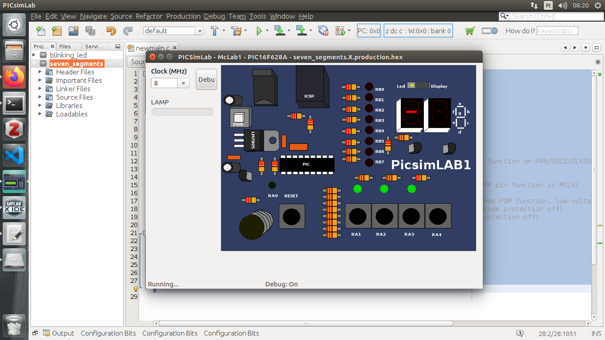
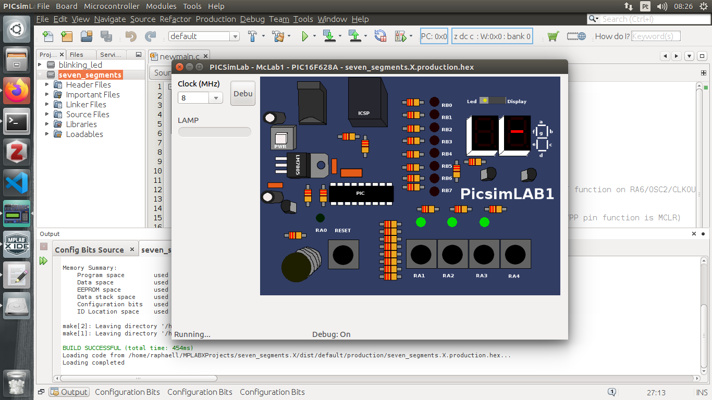
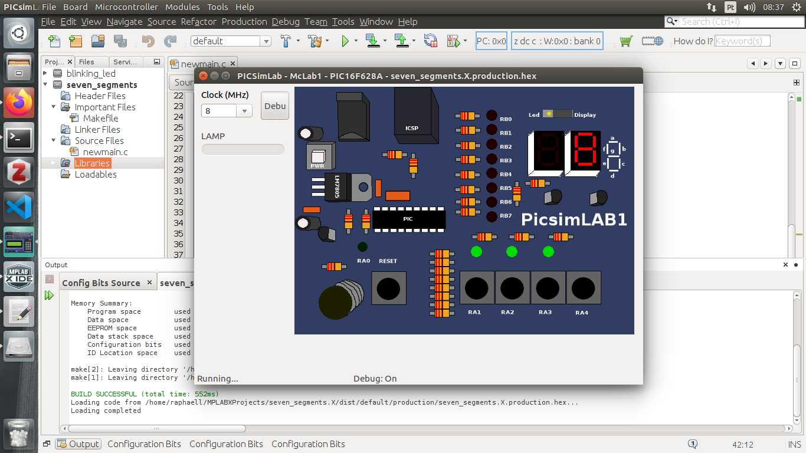
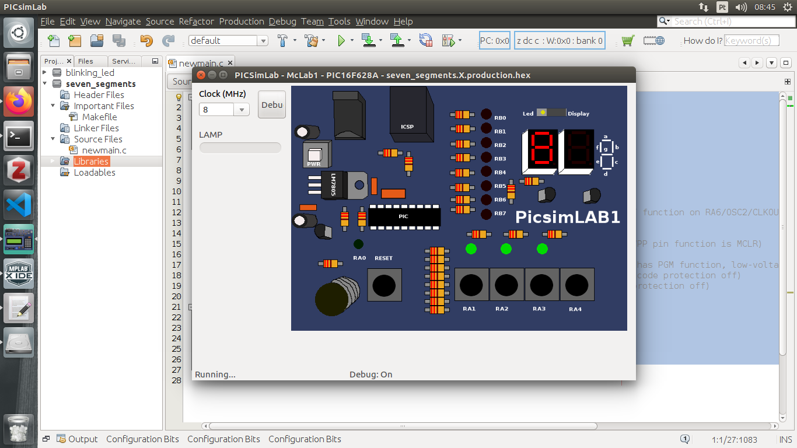

### Seven-Segment Display

#### Professor: Raphaell Maciel de Sousa

1. Create the project seven_segments (use our first class and follow the steps to create the project).

2. Create a project to activate the PIN RB0:

```sh
/*
 * File:   newmain.c
 * Author: raphaell
 *
 * Created on 29 de Fevereiro de 2020, 08:09
 */

#include <xc.h>

#define _XTAL_FREQ 8000000

#pragma config FOSC = EXTRCCLK  // Oscillator Selection bits (RC oscillator: CLKOUT function on RA6/OSC2/CLKOUT pin, Resistor and Capacitor on RA7/OSC1/CLKIN)
#pragma config WDTE = OFF       // Watchdog Timer Enable bit (WDT disabled)
#pragma config PWRTE = OFF      // Power-up Timer Enable bit (PWRT disabled)
#pragma config MCLRE = ON       // RA5/MCLR/VPP Pin Function Select bit (RA5/MCLR/VPP pin function is MCLR)
#pragma config BOREN = ON       // Brown-out Detect Enable bit (BOD enabled)
#pragma config LVP = ON         // Low-Voltage Programming Enable bit (RB4/PGM pin has PGM function, low-voltage programming enabled)
#pragma config CPD = OFF        // Data EE Memory Code Protection bit (Data memory code protection off)
#pragma config CP = OFF         // Flash Program Memory Code Protection bit (Code protection off)

void main(void) {
    
    TRISB0 = 0;
    
    RB0 = 1;
    
    return;
}
```

After putting the switch in the display position, you must see the g segment activated as follow:

<p align="center">
    
</p>  

3. Now, activate the PIN RB4:

```sh
/*
 * File:   newmain.c
 * Author: raphaell
 *
 * Created on 29 de Fevereiro de 2020, 08:09
 */

#include <xc.h>

#define _XTAL_FREQ 8000000

#pragma config FOSC = EXTRCCLK  // Oscillator Selection bits (RC oscillator: CLKOUT function on RA6/OSC2/CLKOUT pin, Resistor and Capacitor on RA7/OSC1/CLKIN)
#pragma config WDTE = OFF       // Watchdog Timer Enable bit (WDT disabled)
#pragma config PWRTE = OFF      // Power-up Timer Enable bit (PWRT disabled)
#pragma config MCLRE = ON       // RA5/MCLR/VPP Pin Function Select bit (RA5/MCLR/VPP pin function is MCLR)
#pragma config BOREN = ON       // Brown-out Detect Enable bit (BOD enabled)
#pragma config LVP = ON         // Low-Voltage Programming Enable bit (RB4/PGM pin has PGM function, low-voltage programming enabled)
#pragma config CPD = OFF        // Data EE Memory Code Protection bit (Data memory code protection off)
#pragma config CP = OFF         // Flash Program Memory Code Protection bit (Code protection off)

void main(void) {
    
    TRISB0 = 0;
    TRISB4 = 0;
    
    RB0 = 1;
    RB4 = 1;
    
    return;
}
```

<p align="center">
    
</p>  

4. Now, activate all segments from the display 2.

```sh
/*
 * File:   newmain.c
 * Author: raphaell
 *
 * Created on 29 de Fevereiro de 2020, 08:09
 */

#include <xc.h>

#define _XTAL_FREQ 8000000

#pragma config FOSC = EXTRCCLK  // Oscillator Selection bits (RC oscillator: CLKOUT function on RA6/OSC2/CLKOUT pin, Resistor and Capacitor on RA7/OSC1/CLKIN)
#pragma config WDTE = OFF       // Watchdog Timer Enable bit (WDT disabled)
#pragma config PWRTE = OFF      // Power-up Timer Enable bit (PWRT disabled)
#pragma config MCLRE = ON       // RA5/MCLR/VPP Pin Function Select bit (RA5/MCLR/VPP pin function is MCLR)
#pragma config BOREN = ON       // Brown-out Detect Enable bit (BOD enabled)
#pragma config LVP = ON         // Low-Voltage Programming Enable bit (RB4/PGM pin has PGM function, low-voltage programming enabled)
#pragma config CPD = OFF        // Data EE Memory Code Protection bit (Data memory code protection off)
#pragma config CP = OFF         // Flash Program Memory Code Protection bit (Code protection off)

void main(void) {
    
    TRISB0 = 0;
    TRISB1 = 0;
    TRISB2 = 0;
    TRISB3 = 0;
    TRISB4 = 0;
    TRISB5 = 0;
    TRISB6 = 0;
    TRISB7 = 0;
    
    RB0 = 1;
    RB1 = 1;
    RB2 = 1;
    RB3 = 1;
    RB5 = 1;
    RB6 = 1;
    RB7 = 1;
    
    RB4 = 1; //Choose between display 1 or 2
    
    return;
}
```

<p align="center">
    
</p>  

It is possible simplify this program as follow:

```sh
/*
 * File:   newmain.c
 * Author: raphaell
 *
 * Created on 29 de Fevereiro de 2020, 08:09
 */

#include <xc.h>

#define _XTAL_FREQ 8000000

#pragma config FOSC = EXTRCCLK  // Oscillator Selection bits (RC oscillator: CLKOUT function on RA6/OSC2/CLKOUT pin, Resistor and Capacitor on RA7/OSC1/CLKIN)
#pragma config WDTE = OFF       // Watchdog Timer Enable bit (WDT disabled)
#pragma config PWRTE = OFF      // Power-up Timer Enable bit (PWRT disabled)
#pragma config MCLRE = ON       // RA5/MCLR/VPP Pin Function Select bit (RA5/MCLR/VPP pin function is MCLR)
#pragma config BOREN = ON       // Brown-out Detect Enable bit (BOD enabled)
#pragma config LVP = ON         // Low-Voltage Programming Enable bit (RB4/PGM pin has PGM function, low-voltage programming enabled)
#pragma config CPD = OFF        // Data EE Memory Code Protection bit (Data memory code protection off)
#pragma config CP = OFF         // Flash Program Memory Code Protection bit (Code protection off)

void main(void) {
    
    TRISB = 0;    
    PORTB = 0b11101111; // ... RB2 RB1 RB0
        
    return;
}
```
<p align="center">
    
</p> 


