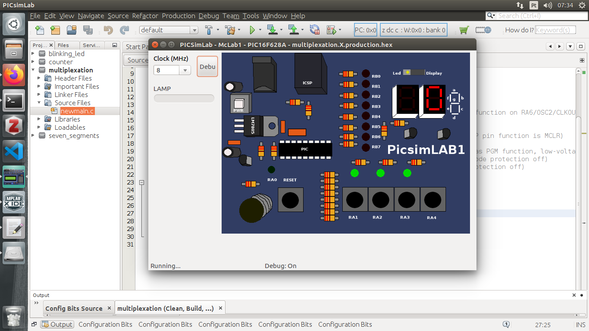

#### Multiplexing seven-segments displays

#### Professor: Raphaell Maciel de Sousa

1. Create the project seven_segments (use our first class and follow the steps to create the project).

2. Write the number zero in the right display, as follow:

    

 

