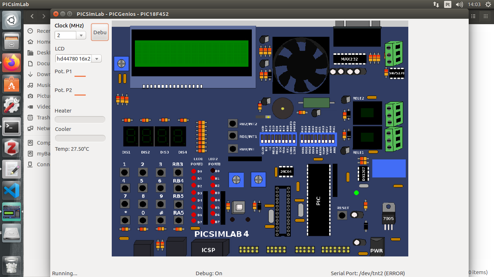
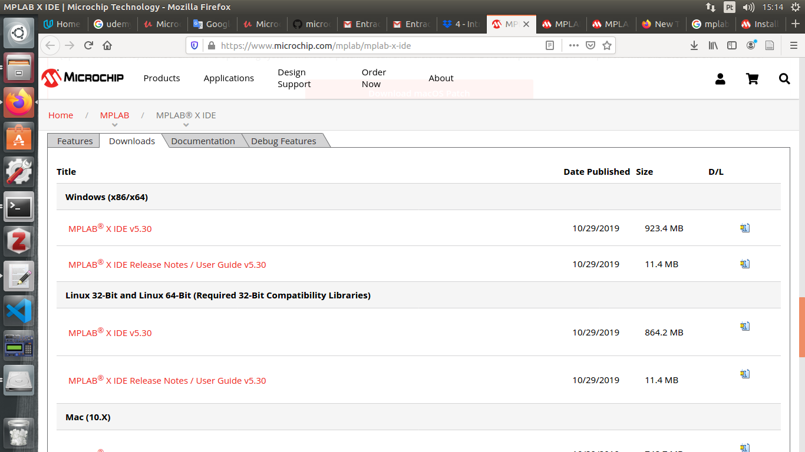

# Course of Microcontrollers
#### Professor: Raphaell Maciel de Sousa
#### Institution: IFPB Cajazeiras
#### Course: Industrial Automation
#### Year: 2020

##### First, install the Pickitlab from:

https://github.com/lcgamboa/picsimlab/releases

Obs.: choose the version 0.7 for ubuntu

<p align="center">
    
</p> 

##### Install the compiler

Here, we are going to use the MPLAB XC8 Compiler. Follow the instructions to download:

https://microchipdeveloper.com/xc8:installation

##### Install the IDE

Now it is time to install the MPLAB X IDE. Go to download section and choose the version for your OS. You can find the MPLAB X here https://www.microchip.com/mplab/mplab-x-ide.

<p align="center">
    
</p> 

Follow the instructions to install the IDE:

https://microchipdeveloper.com/mplabx:installation

```bash
$ tar -xvf MPLABX-vX.XX-linux-installer.tar
$ chmod u+x MPLABX-vX.XX-linux-installer.sh
$ sudo ./MPLABX-vX.XX-linux-installer.sh
```

Obs.: for installation dependencies on 64-bit Linux, follow this tutorial: 

https://microchipdeveloper.com/install:mplabx-lin64

Use the bash to install the dependencies as follow:

```bash
$ sudo apt-get install libc6:i386 libx11-6:i386 libxext6:i386 libstdc++6:i386 libexpat1:i386
```

You can find more details about this setup here:

https://www.youtube.com/watch?v=aUlM6eUv7tA
